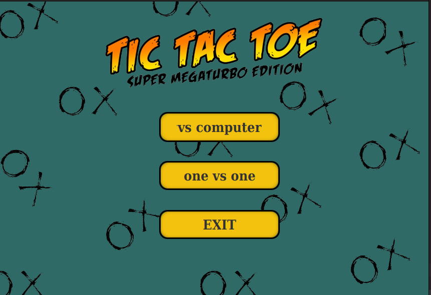
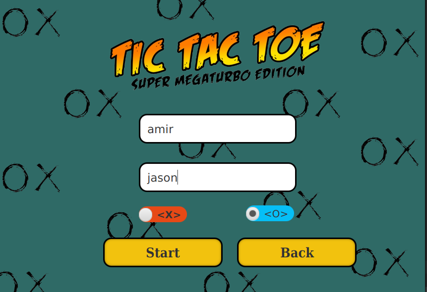
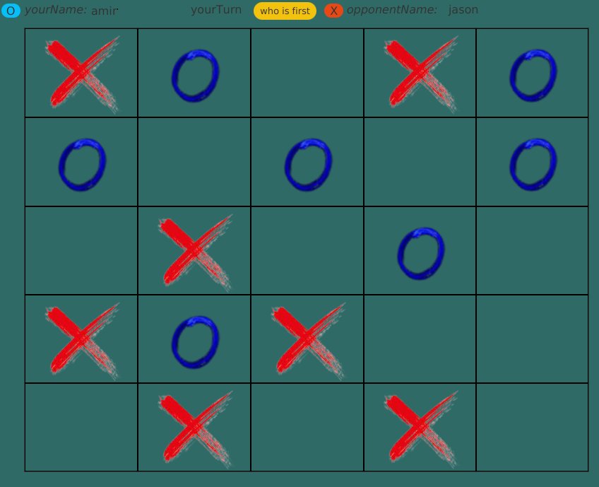

<!DOCTYPE html>
<html>
<head>
</head>
<body>
  <h2></h2>
    <div class="row">
    <div class="column">
      
    </div>
    </div>
</body>
</html>
## :fire::fire:What Is this!!:fire::fire:
  TIC TAC TOE <br>
a simple game that all we know it. it's a good game for playing together.

## :rotating_light:the Rules:rotating_light:
the rules are simple:<br>
first person who has 4 element in following each other without any interrupt
is the winner.<br>
4 element that vertically,horizontally and oblique are connecting to each other 


<!DOCTYPE html>
<html>
<head>
  <style>
  * {
    box-sizing: border-box;
  }
  .column {
    float: left;
    width: 33.33%;
    padding: 5px;
  }
  .row::after {
    content: "";
    clear: both;
    display: table;
  }
</style>
</head>
<body>
  <h2></h2>
    <div class="row">
    <div class="column">
      
    </div>
    <div class="column">
      
    </div>
    <div class="column">
      
    </div>
    </div>
</body>
</html>


## :memo:About:memo:
the first Realise of the game is: 2023-06-25<br>
the last update of the game is: 2023-06-25<br>
the current version is :1.0.0

## :technologist:how to use:technologist:
for run the game clone the project to your local and try to run the Application class<br>
as the code written by the javaFx (The framework of Java) the Application is someThing like this
````Java
public class Application extends javafx.application.Application {
    @Override
    public void start(Stage stage) throws IOException {
        FXMLLoader fxmlLoader = new FXMLLoader(Application.class.getResource("application.fxml"));
        Scene scene = new Scene(fxmlLoader.load(), 858, 590);
        stage.setTitle("Tic Tac Toe");
        stage.setScene(scene);
        stage.centerOnScreen();
        stage.show();
    }

    public static void main(String[] args) throws UnsupportedAudioFileException, LineUnavailableException, IOException {
        launch();
    }
}
````
if you use any IDE just run the Application class and if you want to use terminal
run this command 
````
    $javac Application.java
    $java Applicatoin
````


